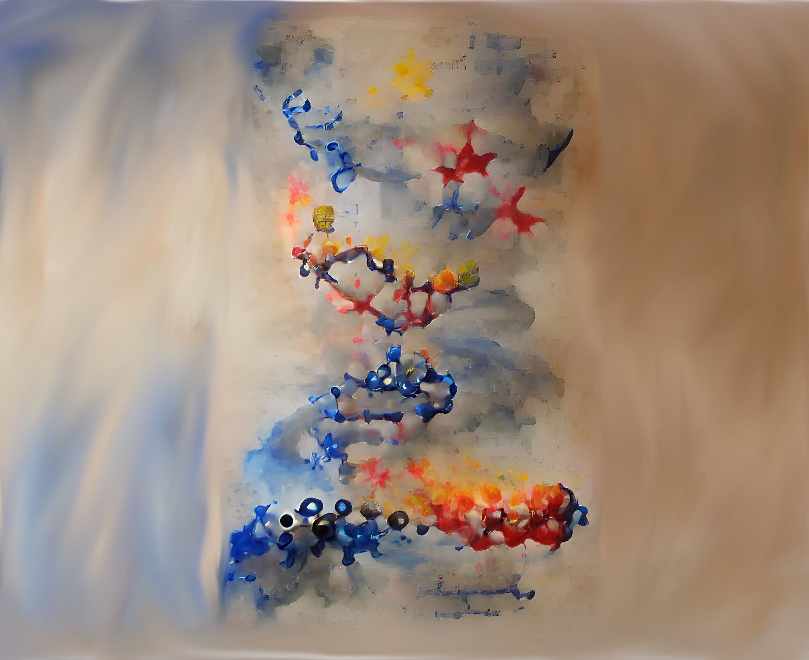

<div id="top"></div>
<!--
*** Thanks for checking out the Best-README-Template. If you have a suggestion
*** that would make this better, please fork the repo and create a pull request
*** or simply open an issue with the tag "enhancement".
*** Don't forget to give the project a star!
*** Thanks again! Now go create something AMAZING! :D
-->


<!-- PROJECT SHIELDS -->
<!--
*** I'm using markdown "reference style" links for readability.
*** Reference links are enclosed in brackets [ ] instead of parentheses ( ).
*** See the bottom of this document for the declaration of the reference variables
*** for contributors-url, forks-url, etc. This is an optional, concise syntax you may use.
*** https://www.markdownguide.org/basic-syntax/#reference-style-links
-->
[![Contributors][contributors-shield]][contributors-url]
[![Forks][forks-shield]][forks-url]
[![Stargazers][stars-shield]][stars-url]
[![Issues][issues-shield]][issues-url]
[![AGPL-3.0 License][license-shield]][license-url]


<!-- PROJECT LOGO -->
<br />
<div align="center">
  <a href="https://github.com/Lets-Cure-This/Frontend">
    
  </a>

<h3 align="center">Let's Cure This</h3>

  <p align="center">
    Dedicated to those affected by malicious Illness and without a voice
    <br />
    <a href="https://github.com/Lets-Cure-This/Frontend"><strong>Explore the docs »</strong></a>
    <br />
    <br />
    <a href="https://github.com/Lets-Cure-This/Frontend">View Demo</a>
    ·
    <a href="https://github.com/Lets-Cure-This/Frontend/issues">Report Bug</a>
    ·
    <a href="https://github.com/Lets-Cure-This/Frontend/issues">Request Feature</a>
  </p>
</div>


<!-- TABLE OF CONTENTS -->
<details>
  <summary>Table of Contents</summary>
  <ol>
    <li>
      <a href="#about-the-project">About The Project</a>
      <ul>
        <li><a href="#built-with">Built With</a></li>
      </ul>
    </li>
    <li><a href="#getting-started">Getting Started</a></li>
    <li><a href="#usage">Usage</a></li>
    <li><a href="#roadmap">Roadmap</a></li>
    <li><a href="#contributing">Contributing</a></li>
    <li><a href="#license">License</a></li>
    <li><a href="#contact">Contact</a></li>
    <li><a href="#acknowledgments">Acknowledgments</a></li>
  </ol>
</details>


<!-- ABOUT THE PROJECT -->
<div align="center" id="about-the-project">
	<h1>About The Project</h1>
	<a href="https://github.com/Lets-Cure-This/"></a>
	<h2>We are</h2>
	<p> 
		A Foundation that hosts rare diseases that have not gained enough traction for the review staff in the Center for Drug Evaluation and Research (CDER) at the Food and Drug Administration (FDA).
	</p>
	<h2>Our mission</h2>
	<p>
		As a non-profit organization that is dedicated to providing a platform for the public to find and access information about rare diseases, Users may appeal to sponsors after meeting the population demographics and can be shared with the appropriate FDA review staff to enable the progression of a particular drug development program.
	</p>
	<h2>We do this by</h2>
	<p>
		Evaluating known information from hosted APIs (GARD, Orphanet, GHR, Disease Ontology (DO), OMIM, MeSH, MEDLINE+, MONDO, HPO, NORD, MEDGEN, NCI, ICD10, AND EFO) and project target product profiles (TPPs), this helps format and label the development of drugs.
	</p>
	<h2>Our vision</h2>
	<p>
		"<b>Let’s Cure This</b>" can facilitate all references of the drug, which may include both human drugs and therapeutic biological products, as well as pre-investigational new drug application (pre-IND) or investigational new drug application (IND) phases of drug development through postmarketing programs to pursue new indications or other substantial changes in labeling (indication/intention of the target drug, dosage, contraindications, warnings, adverse reactions/interactions, clinical pharmacology, nonclinical toxicology, and how to store and handle the drug as well as counseling information).
	</p>
	<a href="#top">
		<p align="right">back to top</p>
	</a>
</div>

<!-- Built With -->
<div id="built-with">
	<h1>Built With</h1>
	<ul>
		<h2>Frontend</h2>
			<li>
				<a href="https://nextjs.org/">NextJS</a>
			</li>
			<li>
				<a href="https://reactjs.org/">React.js</a>
			</li>
			<li>
				<a href="https://sass-lang.com/documentation/syntax#scss">SCSS</a>
			</li>
			<li>
				<a href="">Typescript</a>
			</li>
	<!-- <h2>Backend</h2>
	<li>
		<a href="https://nestjs.com/">NestJS</a>
	</li>
	<li>
		<a href=""></a>
	</li> 
	<br /> -->
	<br />
		<h2>Scientific Computing</h2>
			<li>
				<a href="https://github.com/Lets-Cure-This/LCT_File-Munger">In-House JSON Conversion Tool</a>
			</li>
			<li>
				<a href="">Orphanet API</a>
				<p>NOTE: The data is an assortment of every major Rare Disease collection service.</p>
			</li>
			<li>
				<a href="https://api.rarediseases.info.nih.gov/">GARD/NIH API</a>
				<p>NOTE: <a href="https://disease.ncats.io/browser/">GARD Neo4J API</a> is still down as of 1/12/2021, the official stance has been to sit tight until IT resumes operations. Most likely converting a majority of their [Soft/Hard]-ware to the new systems for the advent of their Open Souce DB found <a href="https://beta.rarediseases.info.nih.gov/about/">here</a>.</p>
			</li>
	</ul>
	<a href="#top">
		<p align="right">back to top</p>
	</a>
</div>

<!-- GETTING STARTED -->
<div id="getting-started">
	<h1>Getting Started</h1>
	<p>Following the steps below will ensure that you have the correct prerequisites installed, allowing you to interact with the source code with minimal interruptions.</p>
	<br>
	<p>Run the following commands to install the dependencies:</p>
	<ol>
		<li>
			<p><b>Install Dependencies</b></p>
			<pre>
				<code>
					yarn install
				</code>
			</pre>
			<br />
			<pre>
				<code>
					npm install
				</code>
			</pre>
		</li>
		<li>
			<b><p>Build the application</b></p>
			<pre>
				<code>
					yarn build
				</code>
			</pre>
			<br />
			<pre>
				<code>
					npm build
				</code>
			</pre>
		</li>
		<li>
			<b><p>Run the built application on localhost:3000</b></p>
			<pre>
				<code>
					yarn run
				</code>
			</pre>
			<br />
			<pre>
				<code>
					npm run
				</code>
			</pre>
		</li>
		<li>
			<b><p>Lint entire soure code</b></p>
			<pre>
				<code>
					yarn run-eslint
				</code>
			</pre>
			<br />
			<pre>
				<code>
					npm run-eslint
				</code>
			</pre>
		</li>
		<li>
			<b><p>Format entire source code</b></p>
			<pre>
				<code>
					yarn run-prettier
				</code>
			</pre>
			<br />
			<pre>
				<code>
					npm run-prettier
				</code>
			</pre>
		</li>
	</ol>
</div>

<!-- ### Installation

1. Get a free API Key at [https://example.com](https://example.com)
2. Clone the repo
   ```sh
   git clone https://github.com/Lets-Cure-This/Frontend.git
   ```
3. Install NPM packages
   ```sh
   npm install
   ```
4. Enter your API in `config.js`
   ```js
   const API_KEY = 'ENTER YOUR API';
   ```

	<a href="#top">
		<p align="right">back to top</p>
	</a> -->


<!-- USAGE EXAMPLES -->
<!-- ## Usage

Use this space to show useful examples of how a project can be used. Additional screenshots, code examples and demos work well in this space. You may also link to more resources.

_For more examples, please refer to the [Documentation](https://example.com)_

	<a href="#top">
		<p align="right">back to top</p>
	</a> -->


<!-- ROADMAP -->
<div id="roadmap">
	<h1>Roadmap</h1>
	<ol>
		<li>Account Authorization/Authentication with MetaMask</li>
		<li>
			Setup a redis server in order to cache the known list of diseases
			<ul>
				<li>Disease List Rendering via RedisDB</li>
				<li>Setup RedisJSON in order to store the converted XML files</li>
				<li>Setup RedisSearch in order to query and fetch in realtime</li>
			</ul>
		</li>
	</ol>
	<p>
		See the <a href="https://github.com/Lets-Cure-This/Frontend/issues">open issues</a> for a full list of proposed features (and known issues).
	</p>
	<a href="#top">
		<p align="right">back to top</p>
	</a>
</div>


<!-- CONTRIBUTING -->
<div id="contributing">
	<h1>Contributing</h1>
	<p>
		Contributions are what make the open source community such an amazing place to learn, inspire, and create. Any contributions you make are <i><b>greatly appreciated</b></i>.
	</p>
	<p>
		If you have a suggestion that would make this better, please fork the repo and create a pull request. You can also simply open an issue with the tag "enhancement".
		Don't forget to give the project a star! Thanks again!
	</p>
	<ol>
		<li>Fork the Project</li>
		<li>Create your Feature Branch (<code>git checkout -b feature/AmazingFeature</code>)</li>
		<li>Commit your Changes (<code>git commit -m 'Add some AmazingFeature</code>)</li>
		<li>Push to the Branch (<code>git push origin feature/AmazingFeature</code>)</li>
		<li>Open a Pull Request</li>
	</ol>
	<a href="#top">
		<p align="right">back to top</p>
	</a>
</div>


<!-- LICENSE -->
<div id="license">
	<h1>License</h1>
	<p>
		Distributed under the MIT License. See `LICENSE.txt` for more information.
	</p>
	<a href="#top">
		<p align="right">back to top</p>
	</a>
</div>

<!-- Contact Area -->
<div id="contact">
	<h1>Contact</h1>
	<table align="center">
		<tr>
			<td valign="top">
				<h2>Lead Developer</h2>
				<h3>Jonathan Dean</h3>
			</td>
			<td valign="top">
				<h2>Lead Scientist</h2>
				<h3>Myisha Thasin</h3>
			</td>
		</tr>
	</table>
	<a href="#top">
		<p align="right">back to top</p>
	</a>
</div>

<h3>Information:</h3>
<a href="https://github.com/Lets-Cure-This/Frontend">
	Source Code
</a>

<!-- MARKDOWN LINKS & IMAGES -->
<!-- https://www.markdownguide.org/basic-syntax/#reference-style-links -->
[contributors-shield]: https://img.shields.io/github/contributors/Lets-Cure-This/Frontend.svg?style=for-the-badge
[contributors-url]: https://github.com/Lets-Cure-This/Frontend/graphs/contributors
[forks-shield]: https://img.shields.io/github/forks/Lets-Cure-This/Frontend.svg?style=for-the-badge
[forks-url]: https://github.com/Lets-Cure-This/Frontend/network/members
[stars-shield]: https://img.shields.io/github/stars/Lets-Cure-This/Frontend.svg?style=for-the-badge
[stars-url]: https://github.com/Lets-Cure-This/Frontend/stargazers
[issues-shield]: https://img.shields.io/github/issues/Lets-Cure-This/Frontend.svg?style=for-the-badge
[issues-url]: https://github.com/Lets-Cure-This/Frontend/issues
[license-shield]: https://img.shields.io/github/license/Lets-Cure-This/Frontend.svg?style=for-the-badge
[license-url]: https://github.com/Lets-Cure-This/Frontend/blob/main/LICENSE.txt

[product-screenshot]: images/screenshot.png